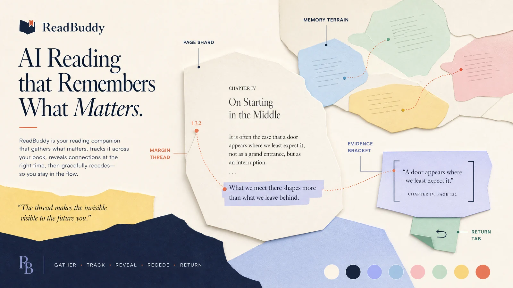
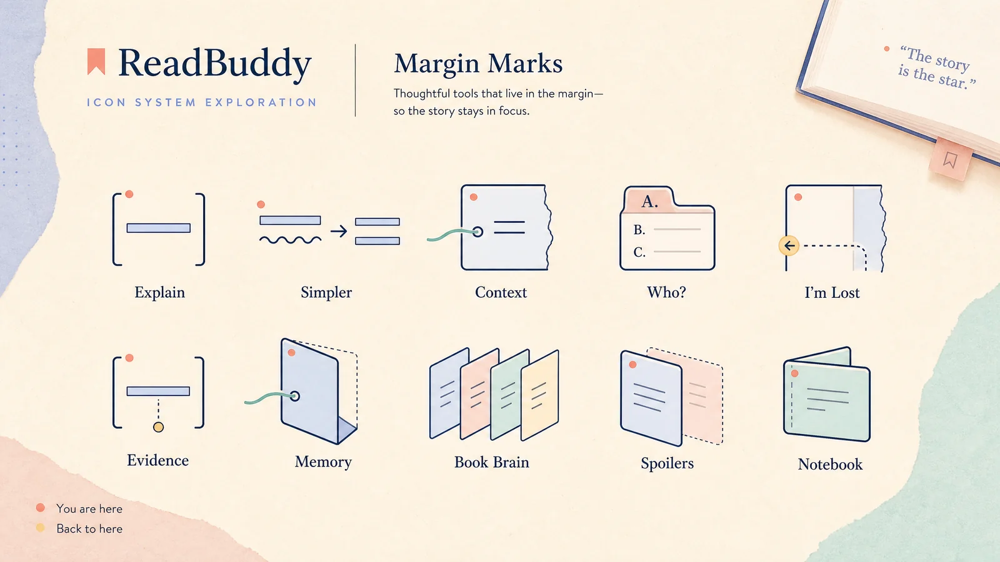
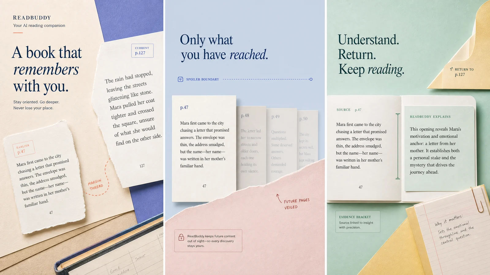
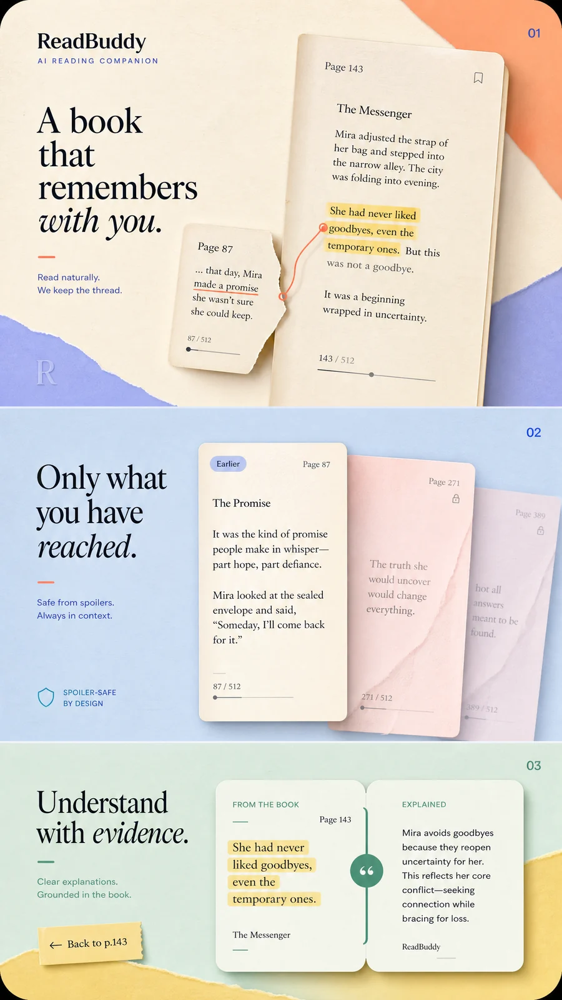
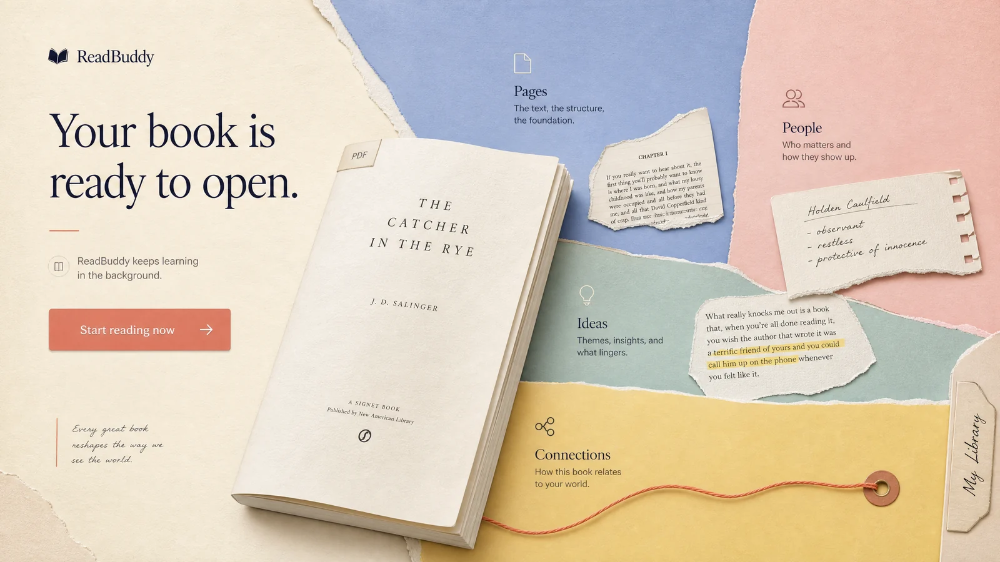
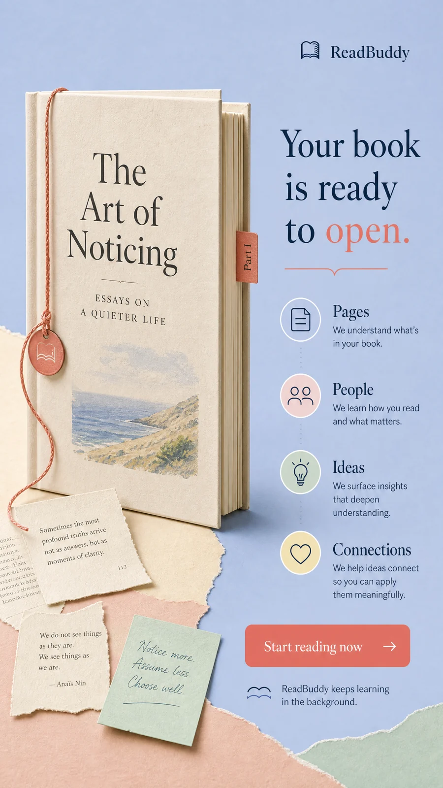
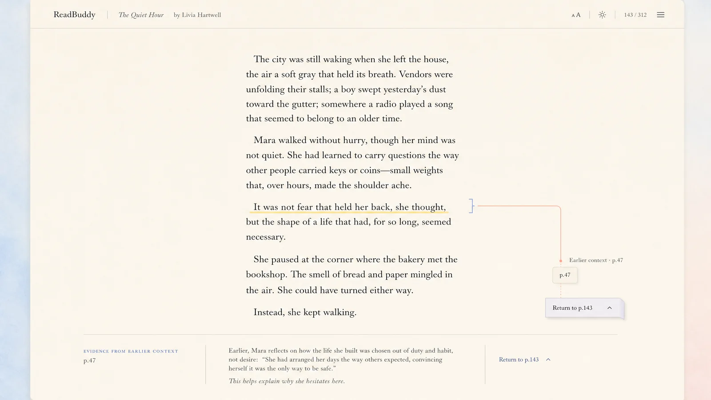
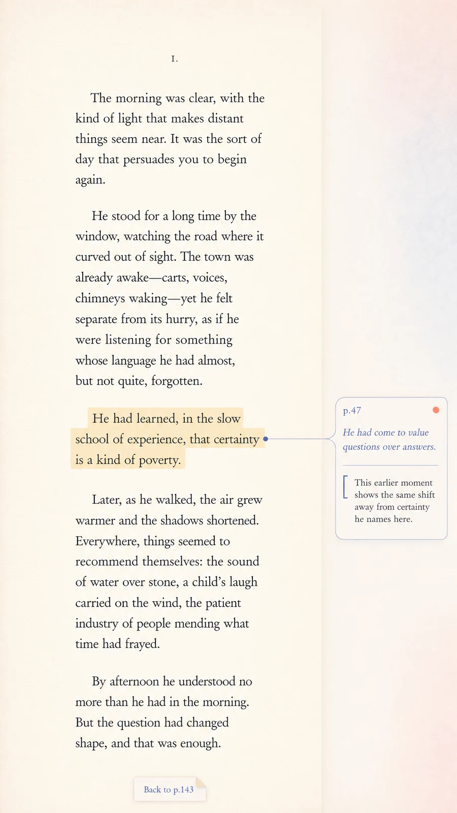

# ReadBuddy — Color, Art, Graphics, Icons, and Minimalism Reset

## Founder decision requested

This proposal changes **the visual language**, not the product strategy. It is designed to make ReadBuddy feel visually alive without becoming noisy: a small number of strong color fields, original reading-native art, recognisable product symbols, and motion that explains a reading action.

> **Approval boundary:** none of the boards below is production code. The currently released landing slice and the quiet reader remain untouched. Approve this system before any broader redesign work begins.

## What changes

| Area | Proposed direction | Explicitly rejected |
|---|---|---|
| Color | Warm paper with periwinkle, powder blue, blush, mint, butter, and rare coral focal points. | Dark-navy default surfaces, rainbow clutter, purple AI gradients. |
| Art | **Memory Terrain**: paper shards, page coordinates, margin notes, and one meaningful connection. | Lifestyle imagery, robots, brains, stock people, blobs, plants, fantasy, constellations. |
| Icons | **Margin Marks**: original reading metaphors with a consistent warm line family. | Generic Lucide-only product identity or emoji-like symbols. |
| Graphics | Four purposeful primitives: Margin Thread, Page Shard, Evidence Bracket, Return Tab. | Decorative networks, extra motifs, generic cards/borders. |
| Motion | Gather, Track, Reveal, Recede, Return—each tied to a reading action. | Fade-up everywhere, bouncing, random parallax, decorative motion. |
| Reader | Quiet typography with a tiny, functional evidence interaction in the margin. | Marketing color fields, chat UI, a permanent AI panel, visual noise. |

## 1. Visual language board

The color system is compositional rather than decorative. A scene uses paper, two soft color fields, and only one coral live point. This creates richer visual identity while preserving focus.

## 2. Margin Marks icon direction

The marks are an **exploration**, not a final identity decision. Their job is to make reading actions memorable without turning the reader into a control panel.

## 3. Three example landing scenes

### Desktop

### Mobile

The landing page becomes a sequence of designed scenes: first the reader’s blocked sentence, then the safe boundary around unread material, then the evidence-led return to reading. This proves intelligence visually instead of asking the user to read feature cards.

## 4. Library concept

| Desktop | Mobile |
|---|---|
|  |  |

The library is a personal reading collection, not a dashboard. Books remain the objects of attention; color fields and the small evidence/memory language only give the collection a world.

## 5. Upload concept

| Desktop | Mobile |
|---|---|
|  |  |

The upload moment should feel like a book opening into a small, orderly world. The product promise remains non-blocking: reading can begin while the book is still being understood.

## 6. Quiet reader concept

| Desktop | Mobile |
|---|---|
|  |  |

The reader does **not** become colorful marketing. It stays quiet. The only signature behavior is the smallest useful evidence interaction: a subtle thread, source passage, explanation, and return.

## Approval test

Approve only if the boards make the product feel **more alive, more premium, more human, and more trustworthy** while still visibly being a reading product. The system fails if it looks like generic SaaS polish, an illustration-first consumer app, an AI-network brand, or a noisy reader.

## Recommended implementation order after approval

1. Codify the palette roles and Margin Marks icon tokens without altering the reader’s current surface.
2. Apply one complete expressive marketing scene at a time, starting with the landing hero and its evidence moment.
3. Extend the system to library and upload only after the landing direction is visually verified.
4. Add the reader’s single evidence interaction last, with the strict quiet-reader acceptance test.
