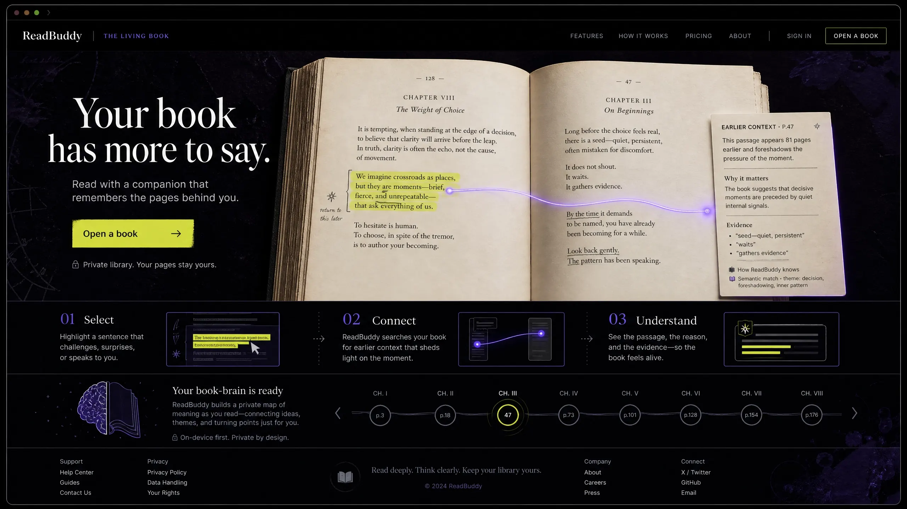
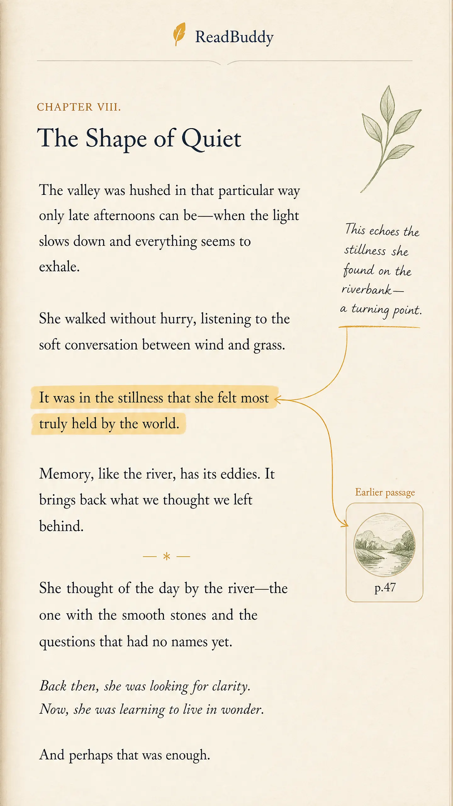
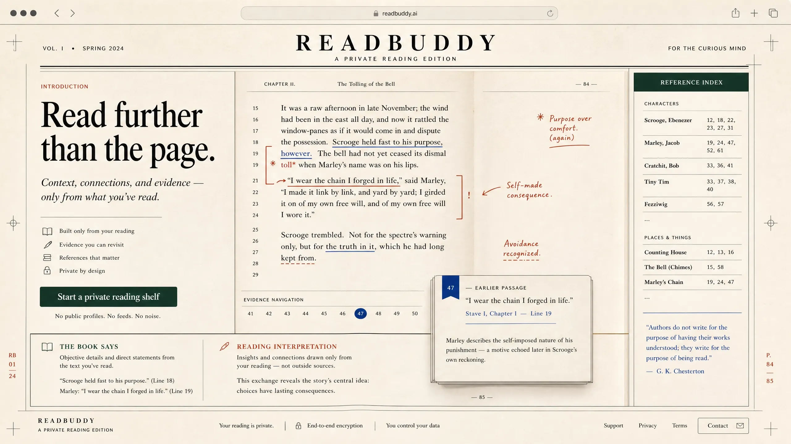
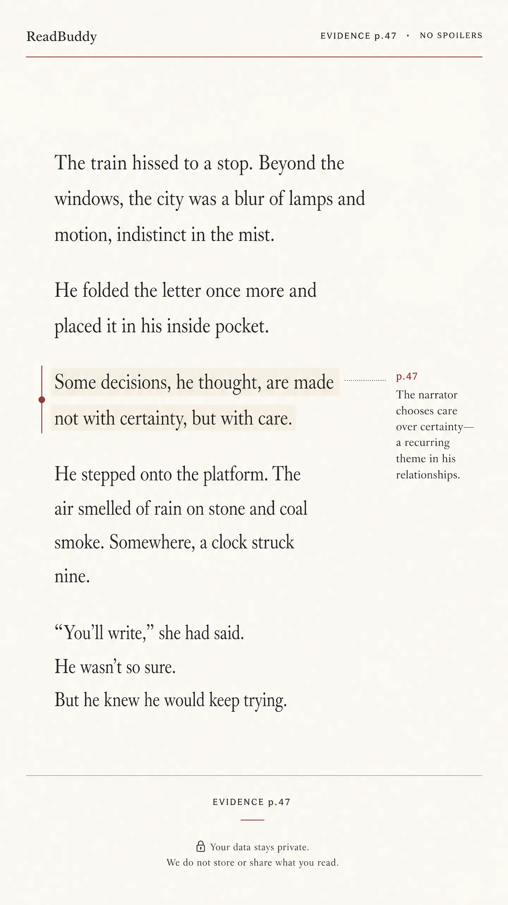
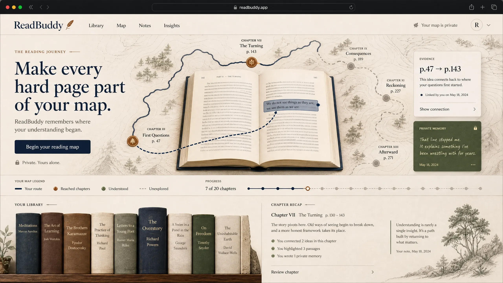
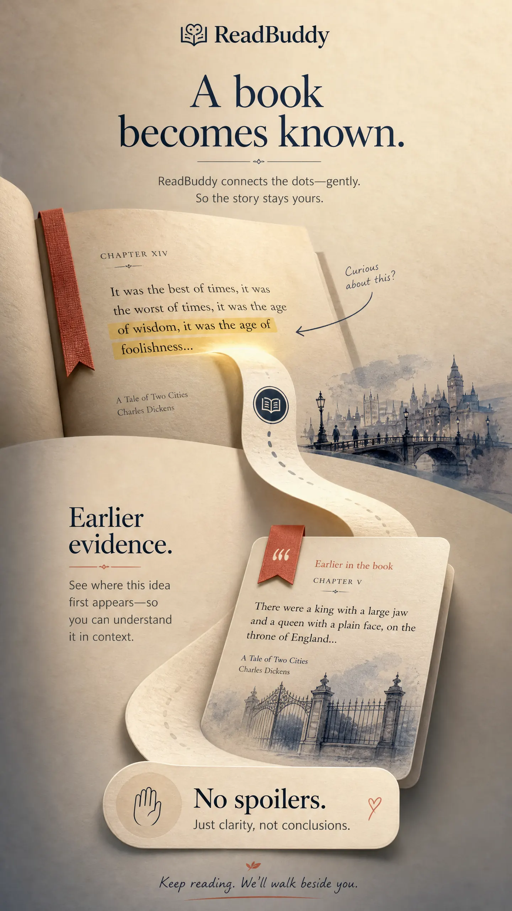

# ReadBuddy Creative Direction Review

## Decision context

ReadBuddy must become memorable without becoming loud. The proposed directions are intentionally different systems, not color variations of one interface. Each begins with the same product truth: a reader should feel that the book remains central while ReadBuddy quietly remembers the surrounding context.

The concepts respond to the initial-trust evidence in the Phase 0 audit. They pair an immediate visual signal with a practical product proof and a natural institutional cue, rather than relying on decoration or fabricated testimonials.[1] [2]

## Direction A — The Living Book

> **Positioning:** A book that wakes up around the reader, slowly revealing an intelligent margin.

| Element | Design decision |
|---|---|
| Brand world | A luminous midnight reading desk. Black-plum background, pale parchment pages, electric citron annotations, and subtle ultraviolet bloom. The page is the protagonist; the interface behaves like a precise nocturnal instrument. |
| Emotional effect | Curiosity, anticipation, and “this is more alive than a PDF.” The contrast between quiet paper and living light makes the intelligence feel present without needing an avatar. |
| Psychology | Uses a single obvious focal artifact — an open book with a living margin — so the visitor can understand the product before reading body copy. It converts through visible cause and effect: a line is selected, related pages glow, then a concise evidence note appears. |
| Hero story | “Your book has more to say.” A three-beat visual: select a difficult sentence; see a thin thread travel to an earlier page; receive an evidence-backed note with `p.47`. Primary action: **Open a book**. |
| Art and motion | Generative typographic `memory threads` grow only after a reading action; a low-frequency constellation of page coordinates sits behind the book. Motion is opacity/transform only, slow, reversible, and never loops around body text. |
| Evidence treatment | Citation pills look like annotated page tabs. A proof drawer briefly shows the earlier highlighted passage, then collapses. The visual language teaches that every claim has a location. |
| Reader treatment | Default reader is almost blank parchment; select text and the living margin activates in a 240ms slide-in. “I’m lost” becomes a small pulsing bookmark at the edge of the page, not a floating chatbot. |
| Trust layer | “Private library. Your pages stay yours.” sits near the primary action. Footer contains privacy, support, terms, and a ReadBuddy-branded domain in final implementation. |
| Main risk | Could become too sci-fi or visually overworked. The approval test is whether a serious adult reader still sees a book first. |

**Board prompts:** one wide desktop landing with interactive book hero, proof strip, and trust footer; one phone reader showing a selected sentence, page-thread, evidence sheet, and calm dark reading mode.

## Direction B — Intellectual Editorial

> **Positioning:** The most beautiful critical edition of the book you are already reading.

| Element | Design decision |
|---|---|
| Brand world | A high-end literary journal, with ink black, soft oat paper, disciplined red editorial marks, deep forest green, and one optimistic cobalt annotation color. The brand treats a reader as a serious thinker. |
| Emotional effect | Authority, self-respect, and calm intellectual aspiration. It should make the reader feel more deliberate, not more entertained. |
| Psychology | Reduces initial uncertainty through hierarchy, material cues, and obvious editorial structure. This route leans cognitive: credibility comes from precision, provenance, readable typography, and no unnecessary AI theater. |
| Hero story | “Read further than the page.” A magazine-spread composition shows a passage, an index-like margin note, a character/reference card, and an earlier source excerpt arranged as a single editorial argument. Primary action: **Start a private reading shelf**. |
| Art and motion | Editorial line rules, typesetter’s crop marks, restrained page-turn dissolves, and a limited pattern of moving footnote numerals. The graphic system is ink, rule, paper, and annotation — never generic floating glass cards. |
| Evidence treatment | Citations display like scholarly footnotes: `47 — earlier passage`, with tap-to-return navigation. “What the book says” and “Reading interpretation” receive visibly different treatments. |
| Reader treatment | Wide, warm reading column; a right-margin `Editor’s note` appears only after selection. The AI uses compact prose and source markers, never chat bubbles. |
| Trust layer | A quiet masthead, date/current version, privacy language, support/contact, and no invented cultural endorsements. Pricing, if added later, appears as clear editorial subscription terms rather than sales cards. |
| Main risk | Can become austere, adult, or too academic for young users. The approval test is whether a 15-year-old finds it empowering rather than school-like. |

**Board prompts:** one desktop editorial homepage with a feature passage and intelligent marginalia; one phone reader with paper grain, footnote navigation, reading controls, and a discrete “Ask from what I’ve read” interaction.

## Direction C — The Reading Journey

> **Positioning:** Every book becomes a place you travel through, with the reader’s understanding as the map.

| Element | Design decision |
|---|---|
| Brand world | Warm dusk, tactile topographic forms, deep indigo routes, copper milestones, moss green “understood” states, and a light atmospheric horizon. It is an emotional journey, not a game dashboard. |
| Emotional effect | Progress, ownership, optimism, and the feeling of building a lifetime of ideas. It makes difficult reading feel like movement rather than failure. |
| Psychology | Uses visible progress and landmarks to create a clear future state: readers see that confusion can become a remembered connection. The progress metaphor is secondary to the book, not a points system. |
| Hero story | “Make every hard page part of your map.” A reader’s route moves through chapter landmarks; selecting a sentence creates a new small connection marker to a prior idea. Primary action: **Begin your reading map**. |
| Art and motion | Abstract topographic paper terrain, section markers, and responsive route lines. On scroll, one route quietly advances; on interaction, a new connection appears. No streaks, medals, or gamified rewards. |
| Evidence treatment | Evidence is a route segment: `p.47 → p.143`. Tapping it opens the earlier passage, and the return action is a physical-looking route retrace. |
| Reader treatment | Book text remains calm. The journey visual appears in the contents panel and chapter recap, never behind the reading paragraph. |
| Trust layer | The map is personal and private. The product explains that progress means only what the reader has reached; unread territory is visually muted, expressing spoiler protection without a technical explanation. |
| Main risk | Could drift toward productivity gamification or fantasy. The approval test is whether the journey feels literary and intimate rather than like an educational game. |

**Board prompts:** one desktop product landing with a warm reading route and a book as the central physical object; one phone library/reader concept with chapter landmarks, progress route, and muted unread territory.

## Comparative recommendation before visual review

Direction A is the strongest candidate for a young, ambitious reader because it is the only direction that gives ReadBuddy an unmistakable interactive product metaphor. Direction B is the strongest trust and seriousness route. Direction C has the greatest emotional retention potential but needs strict restraint to avoid feature bloat or gamification. The high-fidelity boards must decide whether A’s contrast and energy can remain quiet enough for real reading.

## High-fidelity concept boards

The following visual boards are founder-review materials only. They are not product screenshots and no production code has been modified to match them.

| Direction | Desktop board | Mobile board | What to judge first |
|---|---|---|---|
| **A — The Living Book** | [Open desktop concept](assets/creative-direction/a-desktop.webp) | [Open mobile concept](assets/creative-direction/a-mobile.webp) | Does the active margin feel intelligent but still let the book stay central? |
| **B — Intellectual Editorial** | [Open desktop concept](assets/creative-direction/b-desktop.webp) | [Open mobile concept](assets/creative-direction/b-mobile.webp) | Does the editorial authority feel aspirational rather than like schoolwork? |
| **C — The Reading Journey** | [Open desktop concept](assets/creative-direction/c-desktop.webp) | [Open mobile concept](assets/creative-direction/c-mobile.webp) | Does the journey create ownership without becoming a gamified tracker? |

### Direction A — The Living Book

### Direction B — Intellectual Editorial

### Direction C — The Reading Journey

## Critical scorecard

Scores are directional design judgment, not user-test data. They explicitly include the risks surfaced in the Phase 0 audit: ambiguous category, weak product proof, low ownability, and missing institutional confidence.

| Criterion | A — The Living Book | B — Intellectual Editorial | C — The Reading Journey |
|---|---:|---:|---:|
| Immediate product understanding | 9 | 8 | 8 |
| Distinctiveness / visual ownability | 10 | 8 | 9 |
| Reading-first quietness | 8 | 10 | 8 |
| Trust and intellectual seriousness | 8 | 10 | 8 |
| Ambition and emotional energy | 10 | 7 | 9 |
| Mobile clarity | 8 | 9 | 8 |
| Risk of becoming generic | Low | Medium | Low |
| Risk of becoming overdone | Medium | Low | Medium |
| Recommended use | **Primary brand direction** | Trust benchmark and possible secondary mode | Future narrative layer, not primary identity |

## Recommendation

**Choose Direction A — The Living Book**, but apply Direction B’s discipline to its typography, evidence treatment, and privacy surfaces. Direction A best answers the question “why would I care?” in the first few seconds: it shows a book becoming more useful precisely because the reader has already read part of it. That is ReadBuddy’s real advantage, expressed as an ownable visual behavior rather than a feature list.

The implementation should deliberately exclude Direction A’s possible failure modes. The living thread must not animate continuously, the ultraviolet/citron accents must remain small, and no visual effect may obscure text. The reader itself should remain closer to Direction B: parchment, generous type, and precise evidence. Direction C should remain a possible later layer for chapter navigation and resume context, never a gamified progress system.

## ReadBuddy-branded domain migration requirements

The current `sleepline.icu` identity should not remain the public identity for a reading product. Before a migration, choose a ReadBuddy-relevant domain and prepare a reversible launch checklist.

| Workstream | Required action before switching traffic |
|---|---|
| Domain and hosting | Register a ReadBuddy-relevant domain, bind it in hosting, confirm HTTPS, and retain current domains as redirects during a transition period. |
| Google sign-in | Add the new exact `https://<new-domain>/api/auth/google/callback` URL in Google Cloud before directing users to the new domain. |
| Email sign-in later | Verify the new sender domain in Resend before restoring passwordless email. |
| Metadata | Update canonical URL, Open Graph URL/image, page title, favicon, manifest, sitemap, robots directives, and support email. |
| Trust and legal | Publish reachable privacy, terms, support/contact, and data handling information. Do not invent company facts, address, testimonials, or user counts. |
| Continuity test | Test login, session cookies, saved books, upload URLs, shared links, and redirects from every old domain. |

## Founder approval gate

> **Stop condition:** No production UI, reader system, brand migration, new visual asset, motion implementation, or deployment change is authorized by this review.

Please approve one of the following exactly:

1. **Approve A — The Living Book**
2. **Approve B — Intellectual Editorial**
3. **Approve C — The Reading Journey**
4. **Hybrid: A as brand / B as reader**
5. **Revise directions** with specific feedback

After approval, the next implementation plan will convert the chosen direction into a design-token system, responsive pages, loading and interaction states, and a final accessibility/performance pass. Until then, this project remains unchanged in production.

## Founder decision — Custom Hybrid A + B + C

**Approved direction:** The Living Book supplies the signature product metaphor: a book becomes intelligent around the reader through margin memory, earlier passages, and evidence. Intellectual Editorial supplies the discipline for reader typography, citations, privacy, and trust. The Reading Journey is limited to cinematic marketing storytelling that demonstrates memory, evidence, spoiler boundaries, and “I’m Lost.”

**Visual constraint:** ReadBuddy must feel like a beautiful book coming alive around the reader: warm, human, artistic, and cinematic. It must not become neon sci-fi, constellation-themed, fantasy-like, overly academic, or a navy/purple AI SaaS product. Marketing may be dramatic; the reader must become almost invisible.

**Implementation gate:** The accessible boards above must be reviewed before production visual work begins. Once the founder confirms the actual boards are accessible and acceptable, implementation is limited to the hero, first scroll sequence, and strongest margin-memory/evidence moment on desktop and mobile. No full-site redesign is authorized in that next build.

## References

[1]: https://www.nngroup.com/articles/first-impressions-human-automaticity/ "First Impressions Matter: How Designers Can Support Humans’ Automatic Cognitive Processing — Nielsen Norman Group"
[2]: https://www.nngroup.com/articles/trustworthy-design/ "Trustworthiness in Web Design: 4 Credibility Factors — Nielsen Norman Group"
