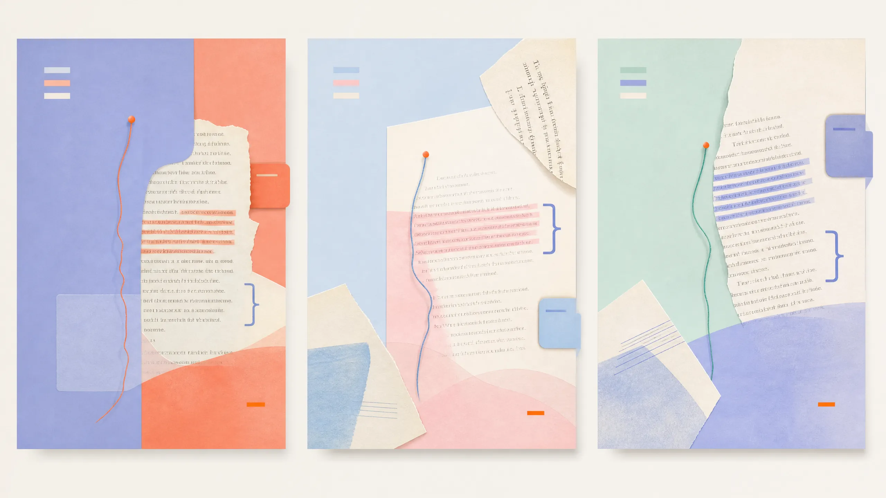
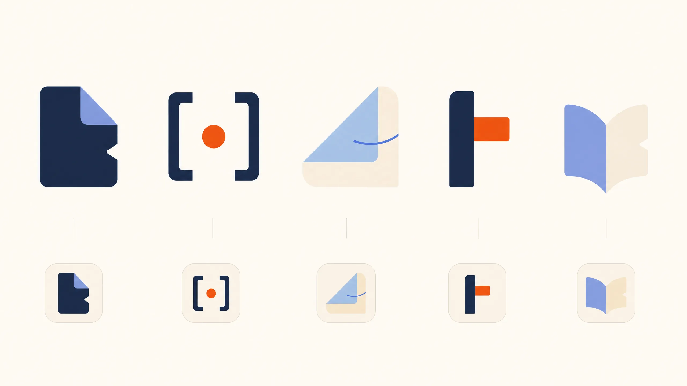
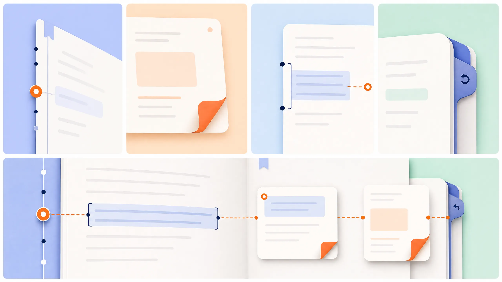
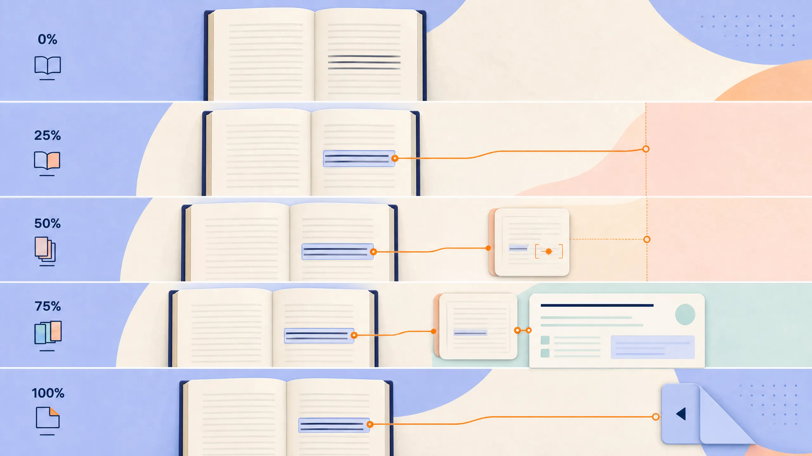

# ReadBuddy Final Visual Refinement Review

## What changed

This final package increases visual confidence without turning ReadBuddy into a busy, technical, fantasy, or generic AI product. It keeps the quiet reader untouched while marketing becomes more visibly intelligent: the book’s own earlier evidence reorganizes around the reader’s current sentence.

The package uses a broader but controlled palette, one saturated signal orange, and four reading-native primitives: **Margin Thread, Page Shard, Evidence Bracket, and Return Tab**. The prior Understanding Bloom has been removed. The current reader-head/book mark is not treated as a final logo.

No production UI, page, art, color, animation, icon, or reader change has been made.

## 1. Revised desktop hero

This composition uses periwinkle, apricot, paper, and a single saturated signal-orange point. The selected current sentence, Page Shard, evidence coordinate, explanation tile, and Return Tab are all visible at once—one strong “how did it know that?” product story.

## 2. Revised mobile hero

The mobile system uses powder blue, blush, paper, and one signal-orange connection. It belongs to the desktop family without shrinking or copying a desktop composition.

## 3. Color in use

The palette is intentionally used as composition rather than decoration. Each setting is paper plus deep ink plus one controlled color pairing: periwinkle/apricot, powder-blue/blush, or mint/periwinkle. Signal orange appears only where context actively connects.

## 4. Brand-mark exploration

The exploration intentionally has no wordmark. It tests five simple, adult-capable directions based on a folded return tab, evidence bracket, page shard, margin mark, and open-page fold. None uses a head, mascot, robot, sparkle, or children’s-literacy symbol.

## 5. Reduced motif system

This board limits the proprietary language to the four primitives that carry actual product meaning. It removes botanical, lifestyle, constellation, network, and generic AI graphic language.

## 6. Updated 0/25/50/75/100 scroll storyboard

The sequence is deliberately legible: **current sentence → earlier page shard → evidence coordinate → contextual explanation → connection resolved → return to reading**. It is a cinematic marketing device only; the reader remains restrained.

## Final approval checklist

| Question | Required answer before hero prototyping |
|---|---|
| Is marketing now visually alive and contemporary without becoming rainbow, neon, fantasy, or SaaS-generic? | Yes. |
| Is the intelligence visible without a chat interface or technical network graphic? | Yes. |
| Are botanical and lifestyle motifs absent? | Yes. |
| Does the reader remain quiet and evidence-first? | Yes; it is unchanged. |
| Are the only definitive reading primitives Margin Thread, Page Shard, Evidence Bracket, and Return Tab? | Yes. |

## Stop condition

> Founder approval is required before any production hero, scroll sequence, visual art, palette, motion, brand mark, icon, or page implementation begins.
