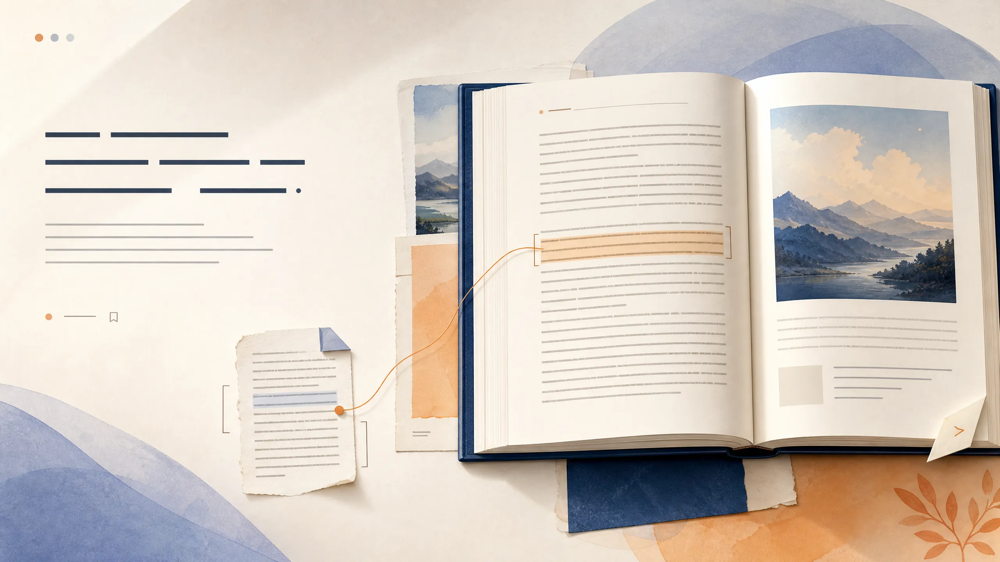
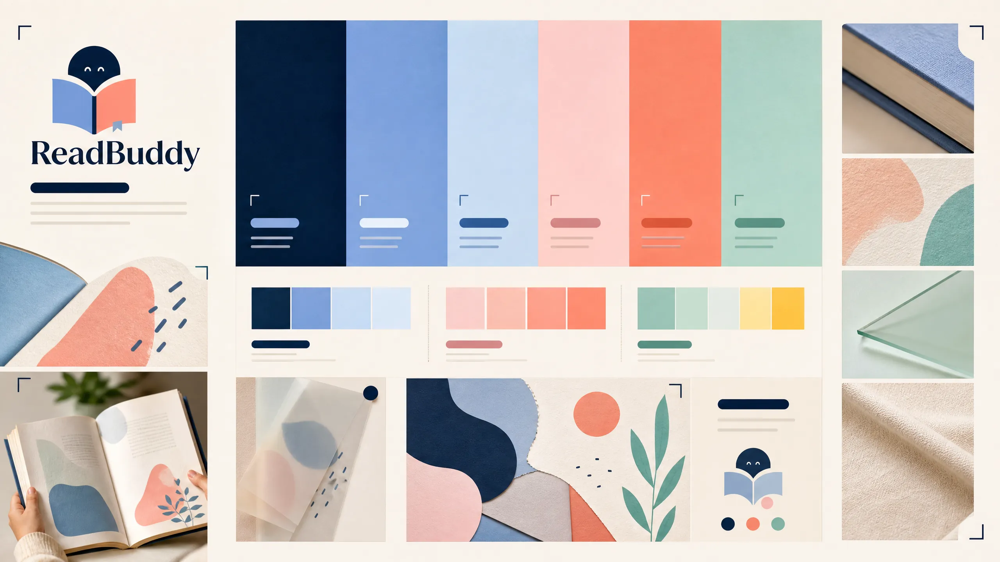
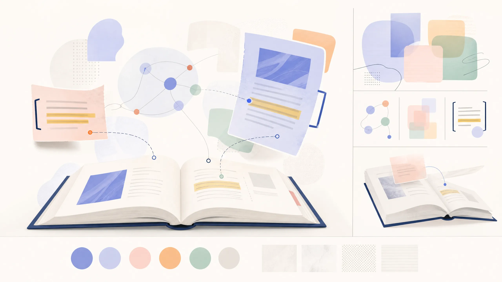
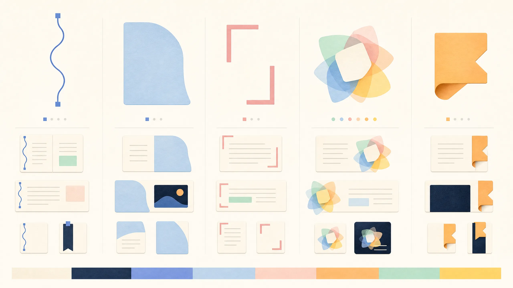
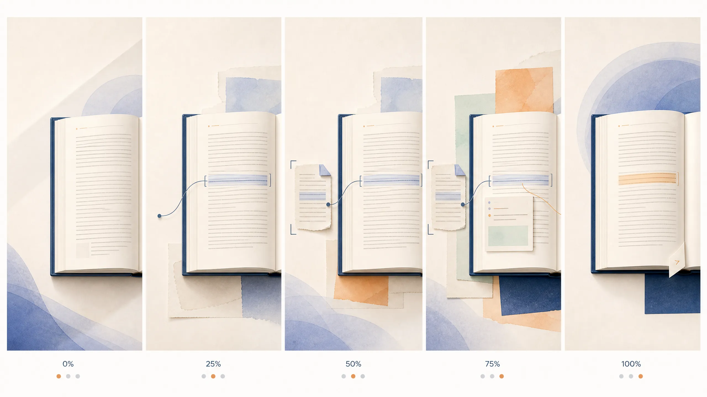
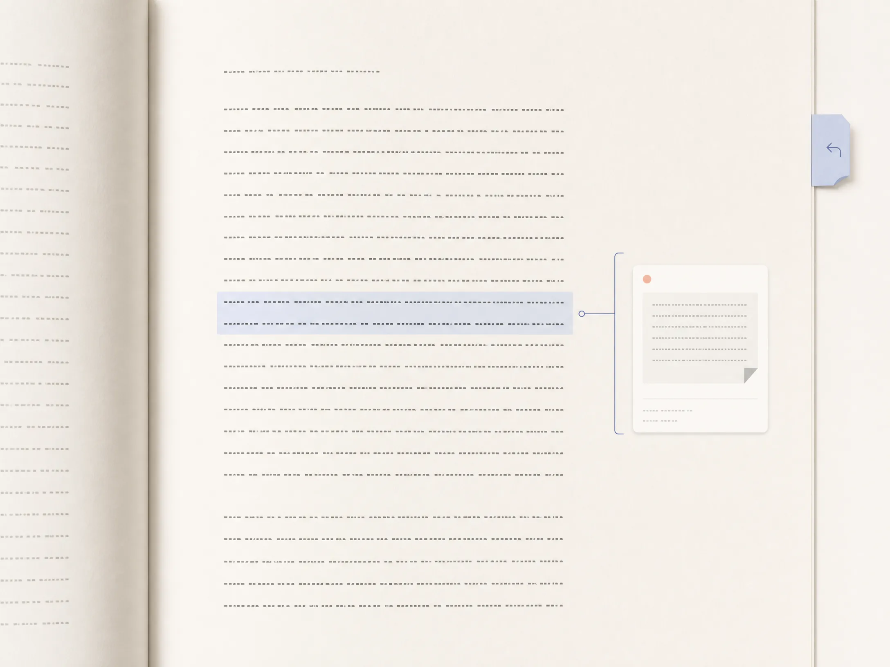

# ReadBuddy Revised Custom Hybrid Visual Review

## Founder brief resolved

This package revises the previous visual directions before implementation. It keeps **A’s intelligence**, **B’s evidence and typographic discipline**, and **C’s cinematic spatial storytelling**, while replacing the rejected black/neon, purple-glow, fantasy, antiquarian, and generic AI-SaaS execution with a contemporary colorful consumer-product visual system.

The required detailed rules live in [the Revised Hybrid Visual System](revised-hybrid-visual-system.md). The boards below are visual concept materials only. They are not production screenshots and no production UI has been changed.

## 1. Revised desktop hero

The desktop hero uses one large readable book surface, controlled atmospheric color, and a single margin-to-evidence connection. It should make the product feel alive before it makes it feel technical.

## 2. Revised mobile hero

The phone presentation uses the same page shard, evidence bracket, margin thread, and return-tab language rather than shrinking a different desktop visual world.

**Visual review note:** The first generated mobile concept confirmed the page-shard and evidence-language continuity, but its deep-ink field and botanical detail were too dominant for the founder’s contemporary, non-fantasy, non-navy-SaaS constraint. The final board retains the information hierarchy while moving the emphasis toward warm paper, periwinkle, powder blue, and apricot.

## 3. Controlled color system

The palette is intentionally rich but controlled. A single moment uses warm paper and deep ink plus no more than two atmospheric colors, rather than combining every accent at once.

## 4. Illustration and art language

Book fragments, passages, annotations, and contextual connections form the art. The result is contemporary and expressive without treating reading like a fantasy world, game, or technical research system.

## 5. Proprietary motif and icon language

The visual language introduces the original Margin Thread, Page Shard, Evidence Bracket, Understanding Bloom, and Return Tab. These become ReadBuddy’s owned alternative to generic icon libraries and AI sparkle symbols.

## 6. Hero scroll storyboard

The scroll sequence demonstrates one product truth: a confusing current sentence becomes clearer because the reader has already reached relevant earlier evidence. It resolves back to the book rather than turning the site into an animation showcase.

## 7. Calmer reader example

This is where B’s discipline controls the hybrid. Reading remains paper, ink, space, and typography. ReadBuddy appears only as an evidence bracket, a compact marginal explanation, and a return path.

**Visual review note:** The calm reader example meets the intended evidence-first restraint. The final storyboard preserves the five-stage sequence with abstract page, shard, bracket, and color-field transitions; it contains no hand, botanical decoration, fantasy, or lifestyle cue.

## Approval checklist

| Founder question | Required answer before coding |
|---|---|
| Does this feel contemporary, colorful, artistic, and consumer-ready? | Yes, without visual noise or generic SaaS cues. |
| Does the book remain central? | Yes; art organizes around the reading moment rather than replacing it. |
| Do desktop and mobile belong to one family? | Yes; both use the same five proprietary primitives. |
| Is the reader calm and serious? | Yes; color and motion are concentrated in marketing, not reading paragraphs. |
| Is the system broad enough for fiction, economics, science, textbooks, and nonfiction? | Yes; it uses abstract reading objects, not genre imagery. |

## Stop condition

> No production hero, scroll sequence, reader UI, animation, color implementation, icon implementation, or page change is authorized until the founder explicitly approves this revised visual package.
