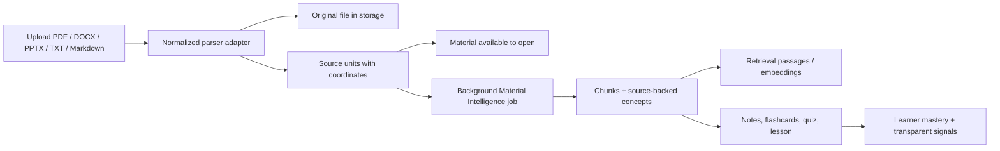

# ZhiyaAI Foundation Architecture

## Product boundary

ZhiyaAI now treats a learner upload as a **Material** rather than assuming every source is a PDF book. The legacy Book and Reader system remains intact because it delivers a distinct narrative-reading promise: pages, progress, spoiler boundaries, highlights, and context are still addressed by `bookId`. The new Material layer adds a shared learning foundation for documents without renaming or deleting any legacy book records.

| Layer | Responsibility | Compatibility promise |
|---|---|---|
| Legacy Book Intelligence | Narrative PDF reading, page progress, citations, spoiler-safe retrieval, highlights, notes, and reader controls | Existing `/read/:bookId` routes and Book Brain tables remain unchanged. |
| Material Intelligence | Normalizes PDF, DOCX, PPTX, TXT, and Markdown into source units, chunks, source-backed concepts, embeddings, and a resumable analysis state | Existing books receive an additive compatibility Material record; no book rows or reader data were deleted. |
| Learner Intelligence | Stores transparent mastery states and minimal learning signals from quiz, flashcard, lesson, and selected Reader actions | Signals contain the interaction type and linked concept, not copied private source text. |
| Learning workspace | Presents Overview, Read, Learn, Flashcards, Quiz, and Notes for a Material | Study items retain source evidence and stay owner-scoped. |

## Shared data model

The migration is additive. `materials` holds source-file metadata and state. `materialUnits` preserves source coordinates such as pages, slides, sections, and line ranges. `materialChunks`, `concepts`, and Material Intelligence store reusable evidence. `materialNotes`, `flashcards`, `studyQuizzes`, `quizQuestions`, `quizAnswers`, `lessons`, and `lessonSteps` provide persistent learning artifacts. `learnerConceptMastery` and `learnerSignals` capture explicit progress and its origin.

> **Trust rule:** Generated summaries, flashcards, quizzes, and lessons only draw from concepts whose definitions and evidence coordinates come from the uploaded Material. If analysis cannot validate its output, the Material is paused for retry instead of being described as understood.

## Ingestion and analysis flow

The user can open the Material as soon as parsing completes. Material Intelligence runs separately. A temporary provider or scheduler failure moves the analysis to a paused state with a retry path; it does not block source access, notes, or the user’s original material.

## Scheduler and provider resilience

Material Intelligence uses the same authenticated, resumable Heartbeat registration model as the established Book Brain pipeline. Scheduler task IDs are stored on the Material Intelligence record and are checked by the callback before it loads a Material. Provider structured output is normalized only for harmless field-shape differences, then validated against the known source chunk identifiers. Invalid evidence is rejected rather than invented.

## Privacy and ownership

All Material router operations begin with an owner-scoped lookup. Anonymous and cross-user access are rejected. The Reader bridge only records a `define` or `simplify` signal when a known concept can be matched to an existing legacy-book compatibility Material; it does not transmit the user’s full reading text into analytics. Generated study artifacts retain evidence inside the owner’s Material workspace.

## Deferred scope

The foundation deliberately does not claim grading certainty for an open-text lesson response, cross-material concept graphs, shared collaboration, recommendations, automated study schedules, or a real-time tutor. These are roadmap candidates, not shipped capabilities.
